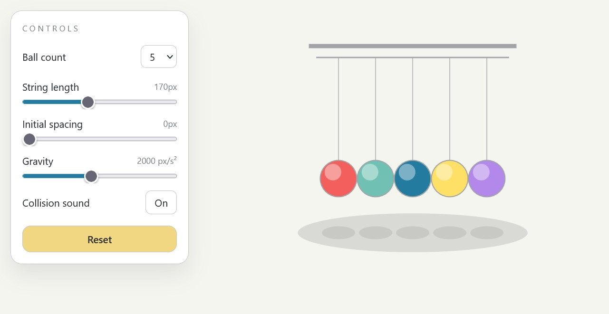

# Newton-s-pendulum

Online Newton’s Pendulum simulation demonstrates the laws of conservation of momentum and energy. By releasing one or more balls, users can observe elastic collisions and energy transfer in real time, helping to visually understand key principles of classical physics in an interactive way.

🔗 **Live demo / Repository:**  
https://huggingface.co/spaces/nikolaife/Newtons_pendulum